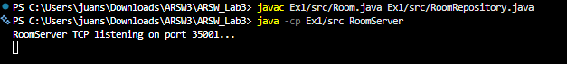
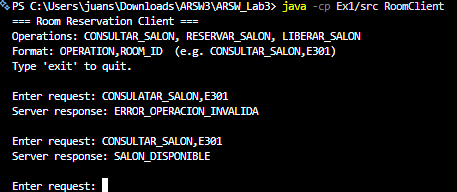

# Exercise 1 - TCP Salon Reservation System

## Description
A client-server application using TCP sockets that manages room reservations for the School. The server keeps the state of four salons (E301–E304) in memory and handles three operations: query, reserve, and release. Each client sends a plain-text request and receives a plain-text response.

## How to Compile
```
javac Ex1/src/Room.java Ex1/src/RoomRepository.java Ex1/src/RoomServer.java Ex1/src/RoomClient.java
```

## How to Run
Open two separate terminals.

Terminal 1 - Server:
```
java -cp Ex1/src RoomServer
```

Terminal 2 - Client:
```
java -cp Ex1/src RoomClient
```

## Test Data

The server pre-loads four salons on startup. These are the valid IDs for all three operations:

| Salon ID | Initial Status |
|----------|----------------|
| E301     | AVAILABLE      |
| E302     | AVAILABLE      |
| E303     | AVAILABLE      |
| E304     | AVAILABLE      |

Any other ID (e.g. E999) returns `ERROR_SALON_NO_EXISTE`.

## Example
```
=== Salon Reservation Client ===
Operations: CONSULTAR_SALON, RESERVAR_SALON, LIBERAR_SALON
Format: OPERATION,SALON_ID  (e.g. CONSULTAR_SALON,E301)
Type 'exit' to quit.

Enter request: CONSULTAR_SALON,E301
Server response: SALON_DISPONIBLE

Enter request: RESERVAR_SALON,E301
Server response: RESERVA_EXITOSA

Enter request: RESERVAR_SALON,E301
Server response: ERROR_OPERACION_INVALIDA

Enter request: LIBERAR_SALON,E301
Server response: LIBERACION_EXITOSA

Enter request: CONSULTAR_SALON,E999
Server response: ERROR_SALON_NO_EXISTE
```

The example shows the full lifecycle of a reservation over raw TCP. Each line typed by the user is sent as a plain string; the server splits it by comma, identifies the operation and the salon ID, updates the in-memory state, and sends back another plain string. The third request fails because the salon is already reserved. The protocol communicates this via the string `ERROR_OPERACION_INVALIDA`, not via any standard error mechanism.

## Notes
- The server listens on port 35001.
- All salon state is kept in memory; it resets when the server restarts.
- The `processRequest` method is synchronized to prevent race conditions if the server is later extended to handle concurrent connections.

## Verification

Server:



Client:



---

## Reflection Questions

**1. How easy would it be to add a new operation to the protocol?**

Adding a new operation requires modifying both the server's `processRequest` switch statement and every client that needs to use the new command. Because the protocol is defined only by string conventions agreed upon informally between both sides, there is no single formal contract. Any developer must read the source code to know the exact format expected. This makes the system fragile to evolve: a typo in the operation name, a missing comma, or a change in field order silently breaks communication with no compile-time warning.

**2. What happens if two clients try to reserve the same salon at the same time?**

As currently written, the server processes one client at a time and blocks until the connection is closed, so true simultaneous concurrency is not possible. However, if the server were refactored to handle each client in its own thread, a race condition would appear: two threads could both read `salon.isReserved() == false` before either one calls `salon.reserve()`, resulting in a double booking. The `processRequest` method is already marked `synchronized` to guard against this, but the server loop would also need to spawn threads for that guard to matter. Concurrency safety requires both thread-based handling and proper synchronization.

**3. Where is the communication contract actually defined: in a formal file or in text conventions?**

The contract exists only as informal text conventions: string literals hardcoded in both `SalonServer.java` and `SalonClient.java`. There is no schema, IDL, or formal specification file. This means the contract is invisible to tooling (no auto-completion, no validation at compile time), and any mismatch between client and server produces a silent runtime error. Contrast this with later styles such as RMI interfaces or Protocol Buffers in gRPC, where the contract is explicit, versioned, and enforced by the compiler.
