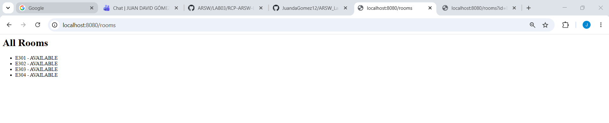
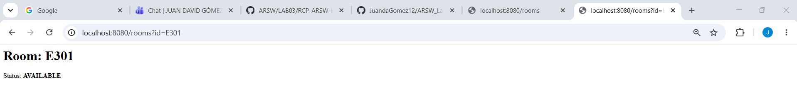
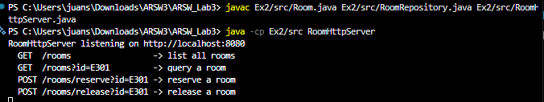

# Exercise 2 - HTTP Salon Reservation System

## Description
The same salon management system from Exercise 1, now exposed over HTTP using Java's built-in `HttpServer`. Instead of a custom protocol, the server speaks standard HTTP, so a browser, curl, or Postman can talk to it directly without a custom client.

## How to Compile
```
javac Ex2/src/Room.java Ex2/src/RoomRepository.java Ex2/src/RoomHttpServer.java
```

## How to Run
```
java -cp Ex2/src RoomHttpServer
```

Then open a browser or use curl to interact with the API.

## Endpoints

| Method | Path                      | Description              |
|--------|---------------------------|--------------------------|
| GET    | /rooms                    | List all rooms           |
| GET    | /rooms?id=E301            | Query a specific room    |
| POST   | /rooms/reserve?id=E301    | Reserve a room           |
| POST   | /rooms/release?id=E301    | Release a room           |

GET is for read-only operations and POST for state changes. Status codes carry meaning: 200 for success, 404 when the salon does not exist, and 409 (Conflict) when the operation is not valid — for example, reserving a salon that is already reserved.

## Test Data

| Room ID | Initial Status |
|---------|----------------|
| E301    | AVAILABLE      |
| E302    | AVAILABLE      |
| E303    | AVAILABLE      |
| E304    | AVAILABLE      |

Any other ID (e.g. E999) returns HTTP 404.

## Example

GET endpoints can be opened directly in a browser:

- List all rooms: http://localhost:8080/rooms
- Query a specific room: http://localhost:8080/rooms?id=E303

POST endpoints require curl or Postman:

```
curl -X POST http://localhost:8080/rooms/reserve?id=E303
```
```
curl -X POST http://localhost:8080/rooms/release?id=E303
```

## Notes
- The server listens on port 8080.
- Reserving an already-reserved room returns HTTP 409.
- Releasing an available room returns HTTP 409.
- Handler methods are `synchronized` to prevent race conditions under concurrent requests.
- All salon state is kept in memory and resets when the server restarts.

## Verification

GET /rooms — all rooms:



GET /rooms?id=E301 — specific room:



Queries:



---

## Reflection Questions

**1. What advantages does HTTP offer over a manually defined text protocol?**

HTTP provides a standard structure (method, path, query parameters, status codes) that any tool already understands. No custom client needed. Status codes like 200, 404, and 409 carry clear meaning that replaces opaque strings like `ERROR_OPERACION_INVALIDA`. HTTP is also stateless by design, which makes scaling and debugging simpler.

**2. What limitations does building an HTTP server without a framework have?**

Everything must be handled manually: routing, query parameter parsing, HTTP method validation, content-type headers, and error responses. Adding a new route means writing a new `HttpHandler` class and registering it by hand. There is no middleware, no dependency injection, no automatic serialization. Frameworks like Spring Boot or Javalin handle all of this automatically.

**3. How would this solution change if JSON were used instead of HTML?**

The response body would be a JSON string like `{"id":"E301","status":"AVAILABLE"}` instead of HTML. The `Content-Type` header would change to `application/json`. Clients could deserialize the response directly into objects instead of parsing HTML. A library like Jackson would handle serialization automatically, replacing the manual string building in `buildSalonHtml` and `buildAllRoomsHtml`.
