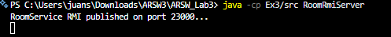
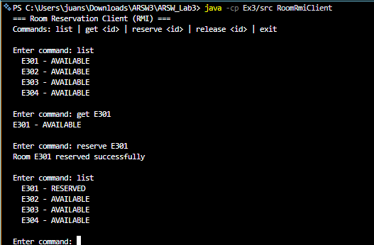

# Exercise 3 - RMI Room Reservation System

## Description
A distributed room management system built with Java RMI. Instead of designing a message format or HTTP routes, the client calls methods on a remote object as if it were local. The RMI registry connects the client to the server-side implementation.

## How to Compile
```
javac Ex3/src/Room.java Ex3/src/RoomService.java Ex3/src/RoomServiceImpl.java Ex3/src/RoomRmiServer.java Ex3/src/RoomRmiClient.java
```

## How to Run
Open two separate terminals.

Terminal 1 - Server:
```
java -cp Ex3/src RoomRmiServer
```

Terminal 2 - Client:
```
java -cp Ex3/src RoomRmiClient
```

## Test Data

| Room ID | Initial Status |
|---------|----------------|
| E301    | AVAILABLE      |
| E302    | AVAILABLE      |
| E303    | AVAILABLE      |
| E304    | AVAILABLE      |

Any other ID (e.g. E999) returns an error from the remote method.

## Example
```
=== Room Reservation Client (RMI) ===
Commands: list | get <id> | reserve <id> | release <id> | exit

Enter command: list
  E301 - AVAILABLE
  E302 - AVAILABLE
  E303 - AVAILABLE
  E304 - AVAILABLE

Enter command: reserve E301
Room E301 reserved successfully

Enter command: get E301
E301 - RESERVED

Enter command: reserve E301
ERROR: room is already reserved

Enter command: release E301
Room E301 released successfully
```

## Notes
- The RMI registry runs on port 23000.
- `Room` implements `Serializable` so instances can travel between JVMs.
- `RoomService` extends `Remote` and is the shared contract between client and server at compile time.
- `reserveRoom` and `releaseRoom` are `synchronized` to prevent race conditions under concurrent clients.

The flow: the server registers the service in the RMI registry under the name `"roomService"`. The client calls `registry.lookup("roomService")` and gets a stub (a local proxy). When the client calls `service.reserveRoom("E301")`, the stub serializes the arguments, sends them to the server, and the server executes the method. The result comes back the same way. From the client's perspective, it looks like a normal local call.

## Verification

Server:



Client:



---

## Reflection Questions

**1. What is the main difference between calling a remote method via RMI and calling it via HTTP or TCP?**

With TCP and HTTP, you manually format messages, send them, and parse the response on the other side. With RMI, the network is completely hidden. The client calls `service.reserveRoom("E301")` like a local method. There is no message format to design or parse. The RMI stub handles serialization and transmission transparently.

**2. What happens if the RMI registry is not running when the client starts?**

The client throws a `ConnectException` or `NotBoundException` immediately when it tries to contact the registry. Unlike HTTP, RMI has no built-in reconnection logic. The client must catch these exceptions explicitly and decide whether to retry or give up.

**3. What are the main limitations of RMI compared to HTTP or gRPC?**

| Aspect | RMI | HTTP / gRPC |
|---|---|---|
| Language support | Java only | Any language |
| Firewall / cloud | Uses dynamic ports, hard to configure | Standard ports, works everywhere |
| Interoperability | JVM only | Language-agnostic |

RMI works great inside a Java-only system, but it cannot communicate with services written in Python, Go, or any other language.
