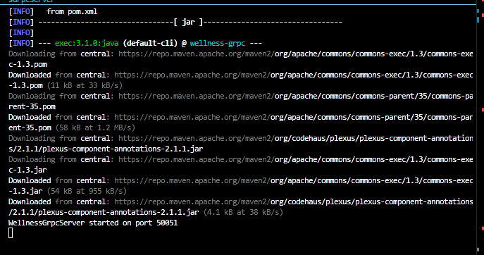
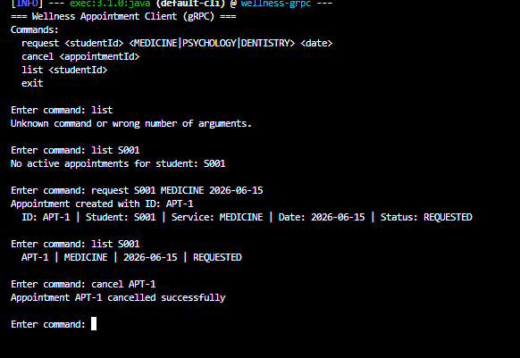

# Exercise 4 - gRPC Wellness Appointment System

## Description
A wellness appointment service built with gRPC and Protocol Buffers. The contract is a `.proto` file that describes the service, request/response messages, and enumerations. The server manages appointments in memory; the client is an interactive command-line interface.

## Project Structure
```
Ex4/
├── pom.xml
├── src/main/proto/
│   └── wellness.proto              <- formal contract
└── src/main/java/edu/eci/arsw/wellness/
    ├── WellnessGrpcServer.java
    └── WellnessGrpcClient.java
```

The only hand-written files are `wellness.proto`, `WellnessGrpcServer.java`, and `WellnessGrpcClient.java`. Everything else (message classes, service stubs, base server) is generated automatically by Maven from the proto file.

## How to Compile
```
cd Ex4
mvn clean compile
```

## How to Run
Open two separate terminals inside `Ex4/`.

Terminal 1 - Server:
```
mvn exec:java "-Dexec.mainClass=edu.eci.arsw.wellness.WellnessGrpcServer"
```

Terminal 2 - Client:
```
mvn exec:java "-Dexec.mainClass=edu.eci.arsw.wellness.WellnessGrpcClient"
```

## Test Data

There are no pre-loaded appointments. All data is created at runtime.

- Student IDs: any value such as S001, S002, S003.
- Service types: MEDICINE, PSYCHOLOGY, DENTISTRY.
- Dates: any string (e.g. 2026-06-15).
- Appointment IDs: auto-generated by the server (APT-1, APT-2, ...).

## Example
```
=== Wellness Appointment Client (gRPC) ===
Commands:
  request <studentId> <MEDICINE|PSYCHOLOGY|DENTISTRY> <date>
  cancel <appointmentId>
  list <studentId>
  exit

Enter command: request S001 PSYCHOLOGY 2026-06-15
Appointment created with ID: APT-1
  ID: APT-1 | Student: S001 | Service: PSYCHOLOGY | Date: 2026-06-15 | Status: REQUESTED

Enter command: list S001
  APT-1 | PSYCHOLOGY | 2026-06-15 | REQUESTED

Enter command: cancel APT-1
Appointment APT-1 cancelled successfully

Enter command: list S001
No active appointments for student: S001
```

## Notes
- The gRPC server listens on port 50051.
- `getAppointments` only returns appointments with status `REQUESTED`; cancelled ones are filtered out.
- Appointment IDs are generated as APT-1, APT-2, etc. using an `AtomicInteger`.
- `ConcurrentHashMap` is used on the server for thread safety without explicit synchronization.

## Verification

Server:



Client:



---

## Reflection Questions

**1. Why is the `.proto` file considered a contract?**

It formally defines what messages exist, what fields they have, what types those fields are, and what operations the service exposes. Both client and server generate their code from the same file, so any mismatch is caught at compile time. Unlike the text conventions from Exercise 1 or the Java interface from Exercise 3, a proto contract is language-agnostic and can generate code for Java, Python, Go, and more from a single source.

**2. How easy would it be to create a client in another language?**

Very easy. The same `wellness.proto` file can be given to the `protoc` compiler with a different plugin (`--python_out`, `--go_out`) to generate an equivalent client in Python or Go. The developer only writes the application logic; serialization and method dispatch are generated automatically.

**3. What differences do you find between RMI and gRPC?**

| Aspect | RMI | gRPC |
|---|---|---|
| Contract | Java interface — JVM only | `.proto` file — language-agnostic |
| Language support | Java only | Java, Python, Go, C++, and more |
| Serialization | Java object serialization | Protocol Buffers (binary, compact) |
| Firewall / cloud | Dynamic ports, problematic | HTTP/2, standard port |

Both hide the network behind a method call, but gRPC is the language-agnostic modern version of that idea.
