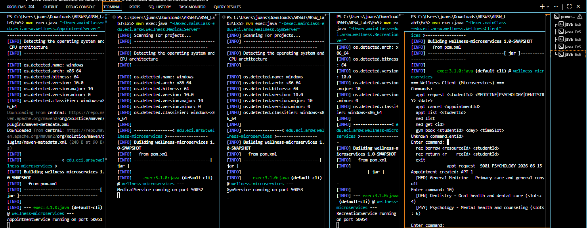

# Exercise 5 - Wellness University Microservices

## Description
The wellness system split into four independent gRPC microservices, each with a single responsibility. Every service has its own `.proto` contract, its own port, and its own in-memory state. A single client opens four channels and routes commands to the right service.

## Service Responsibilities

| Service | Responsibility | Port |
|---|---|---|
| AppointmentService | Manages medical appointment requests and cancellations | 50051 |
| MedicalService | Exposes available specialties and slot availability | 50052 |
| GymService | Handles gym session bookings per student | 50053 |
| RecreationService | Controls borrowing and returning of recreational resources | 50054 |

## Project Structure

```
Ex5/
├── pom.xml
├── src/main/proto/
│   ├── appointment.proto
│   ├── medical.proto
│   ├── gym.proto
│   └── recreation.proto
└── src/main/java/edu/eci/arsw/wellness/
    ├── AppointmentServer.java
    ├── MedicalServer.java
    ├── GymServer.java
    ├── RecreationServer.java
    └── WellnessClient.java
```

## How to Compile
```
cd Ex5
mvn clean compile
```

## How to Run
Open five separate terminals inside `Ex5/`.

Terminal 1 - AppointmentService:
```
mvn exec:java "-Dexec.mainClass=edu.eci.arsw.wellness.AppointmentServer"
```

Terminal 2 - MedicalService:
```
mvn exec:java "-Dexec.mainClass=edu.eci.arsw.wellness.MedicalServer"
```

Terminal 3 - GymService:
```
mvn exec:java "-Dexec.mainClass=edu.eci.arsw.wellness.GymServer"
```

Terminal 4 - RecreationService:
```
mvn exec:java "-Dexec.mainClass=edu.eci.arsw.wellness.RecreationServer"
```

Terminal 5 - Client:
```
mvn exec:java "-Dexec.mainClass=edu.eci.arsw.wellness.WellnessClient"
```

## Test Data

**AppointmentService**: no pre-loaded data. Use any student ID (S001, S002, S003) and service type: MEDICINE, PSYCHOLOGY, DENTISTRY. IDs are auto-generated (APT-1, APT-2, ...).

**MedicalService** pre-loads three specialties:

| Specialty ID | Name             | Available Slots |
|--------------|------------------|-----------------|
| MED          | General Medicine | 10              |
| PSY          | Psychology       | 6               |
| DEN          | Dentistry        | 4               |

**GymService**: no pre-loaded sessions. Use any student ID and a time slot (e.g. Monday 08:00-09:00). IDs are auto-generated (GYM-1, GYM-2, ...).

**RecreationService** pre-loads four resources:

| Resource ID | Name            | Type    |
|-------------|-----------------|---------|
| BB01        | Basketball      | SPORT   |
| TT01        | Table Tennis    | SPORT   |
| BD01        | Badminton Set   | SPORT   |
| BK01        | Board Game Kit  | LEISURE |

## Example

```
=== Wellness Client (Microservices) ===

Enter command: med list
  [MED] General Medicine - Primary care and general consultations (slots: 10)
  [PSY] Psychology - Mental health and counseling (slots: 6)
  [DEN] Dentistry - Oral health and dental care (slots: 4)

Enter command: appt request S001 PSYCHOLOGY 2026-06-15
Appointment created: APT-1

Enter command: appt list S001
  APT-1 | PSYCHOLOGY | 2026-06-15 | REQUESTED

Enter command: gym book S001 Monday 08:00-09:00
Session booked: GYM-1

Enter command: rec list
  [BB01] Basketball (SPORT) - AVAILABLE
  [TT01] Table Tennis (SPORT) - AVAILABLE
  [BD01] Badminton Set (SPORT) - AVAILABLE
  [BK01] Board Game Kit (LEISURE) - AVAILABLE

Enter command: rec borrow BB01 S001
BB01 lent to S001

Enter command: rec list
  [BB01] Basketball (SPORT) - BORROWED by S001
  [TT01] Table Tennis (SPORT) - AVAILABLE
  ...
```

## Notes
- Each service manages its own state with no shared memory or database.
- The client must know all four ports — this is the problem that Exercise 6 solves.
- `ConcurrentHashMap` and `synchronized` are used for thread safety under concurrent gRPC calls.

## Verification



---

## Reflection Questions

**1. Why did you choose to separate these services and not others?**

Each service was separated along a natural responsibility boundary: appointments are transactional (create, cancel, query); medical specialties are reference data; gym sessions are a time-slot booking problem; recreational resources are a lending problem. These four domains have different data and change for different reasons. Splitting further (e.g., separating `RequestAppointment` from `CancelAppointment`) would create overly small services with no real benefit.

**2. What data belongs to each service?**

- **AppointmentService**: appointment records (id, studentId, serviceType, date, status).
- **MedicalService**: specialty catalog (id, name, description, available slots).
- **GymService**: gym session bookings (id, studentId, day, timeSlot).
- **RecreationService**: physical resource inventory (id, name, type, availability, borrowedBy).

No service shares a data store with another. If `AppointmentService` needs to know whether a specialty exists, it would call `MedicalService`.

**3. What risk appears when the client knows all the services?**

The client becomes tightly coupled to the deployment topology. If any service moves to a different port, the client must be updated. If a new service is added, the client must be extended too. The client also must handle partial failures on its own. This is exactly the problem that an API Gateway solves.
